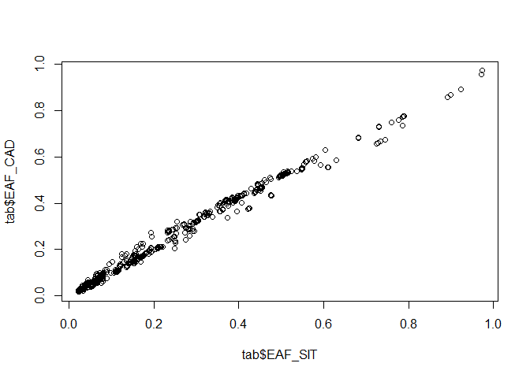

Funktionelle Genomanalysen 2023 (09-CRT-A006)
================
Dr. Janne Pott
09.-11. Juni 2023

- <a href="#allgemeine-informationen"
  id="toc-allgemeine-informationen">Allgemeine Informationen</a>
  - <a href="#initialisierung" id="toc-initialisierung">Initialisierung</a>
  - <a href="#daten-einlesen" id="toc-daten-einlesen">Daten einlesen</a>
- <a href="#colocalisation-analyse"
  id="toc-colocalisation-analyse">Colocalisation-Analyse</a>
  - <a href="#visualisierung" id="toc-visualisierung">Visualisierung</a>
  - <a href="#harmonisierung" id="toc-harmonisierung">Harmonisierung</a>
  - <a href="#coloc" id="toc-coloc">Coloc</a>
  - <a href="#sensitivitaet" id="toc-sensitivitaet">Sensitivitaet</a>
- <a href="#sessioninfo" id="toc-sessioninfo">SessionInfo</a>

# Allgemeine Informationen

**Ziel**: Das Ziel dieses Tutoriums ist es, fuer drei Phaenotypen eine
Colocalisation-Analyse durchzufuehren, um die praktische Anwendung und
Interpretation der Ergebnisse dieser Methode aufzuzeigen.

**Daten**: Wir werden in diesem Beispiel Teilmengen von bereits
publizierten GWAS verwenden

- LDLC Summary Statistics von [Surakka, I. et al. Nat Genet
  (2015).](https://www.nature.com/articles/ng.3300), Link to data:
  <http://diagram-consortium.org/2015_ENGAGE_1KG/>
- CAD Summary Statistics von [Nikpay, M. et al. Nat Genet
  (2015).](https://www.nature.com/articles/ng.3396), Link to data:
  <http://www.cardiogramplusc4d.org/data-downloads/>
- Sitosterol Summary Statistics von [Scholz, M. et al. Nat Commun
  (2022).](https://www.nature.com/articles/s41467-021-27706-6), Link to
  data: <https://zenodo.org/record/5607613>

**Hinweis**: Das Sitosterol-Paper kennen Sie bereits aus der Vorlesung.
Wir werden hier aehnliche Analysen durchfuehren, aber nicht die exakt
gleichen, da wir *nur* die Summary Statistics und nicht die
konditionierten Statistiken verwenden werden. Zusaetzlich wird nur der
Lokus auf Chromosom 2 betrachtet. Es handelt sich also nur um ein
Minimal-Beispiel, wir werden nicht die exakten Werte der Publikation
replizieren.

## Initialisierung

Zuerst laden wir alle notwendigen Pakete. Es handelt sich hierbei um
**alle** Pakete fuer beide Tutorials!

``` r
# load required packages
library(coloc)
```

    ## This is coloc version 5.2.2

``` r
library(data.table)
setDTthreads(1)
library(ggplot2)
library(ggpubr)
library(hyprcoloc)
library(plyr)
```

    ## 
    ## Attaching package: 'plyr'

    ## The following object is masked from 'package:ggpubr':
    ## 
    ##     mutate

``` r
library(MendelianRandomization)
```

## Daten einlesen

Im Moodle-Kurs finden Sie eine .RData Datei, die bereits alle
notwendigen Tabellen enthaelt und einfach in R eingelesen werden kann.
Sie enthaelt die folgenden *data.tables*:

- tab_LDL
- tab_CAD
- tab_SIT

Das R-Paket *data.table* ist sehr performant fuer das handling von
grossen Daten in R. Weitere Infos dazu finden Sie unter
<https://r-datatable.com>.

``` r
load("RPractical.RData")
ls()
```

    ## [1] "tab_CAD" "tab_LDL" "tab_SIT" "time0"

``` r
str(tab_LDL)
```

    ## Classes 'data.table' and 'data.frame':   7404 obs. of  8 variables:
    ##  $ chr     : chr  "chr2" "chr2" "chr2" "chr2" ...
    ##  $ pos     : int  43072828 43072997 43073247 43073548 43074225 43074392 43074468 43075563 43076226 43076271 ...
    ##  $ EA_LDL  : chr  "G" "G" "G" "G" ...
    ##  $ OA_LDL  : chr  "C" "T" "A" "T" ...
    ##  $ beta_LDL: num  -0.002394 0.000829 -0.00232 -0.002323 -0.004573 ...
    ##  $ SE_LDL  : num  0.00634 0.0071 0.00634 0.00633 0.00646 ...
    ##  $ pval_LDL: num  0.706 0.907 0.714 0.714 0.479 ...
    ##  $ N_LDL   : int  58309 58313 58314 58310 58322 58312 58312 58311 53241 58316 ...
    ##  - attr(*, ".internal.selfref")=<externalptr>

``` r
str(tab_CAD)
```

    ## Classes 'data.table' and 'data.frame':   7558 obs. of  10 variables:
    ##  $ rsID    : chr  "rs1123695" "rs78735937" "rs57242328" "rs4953671" ...
    ##  $ chr     : int  2 2 2 2 2 2 2 2 2 2 ...
    ##  $ pos     : int  43072828 43072997 43073247 43073548 43074225 43074392 43074468 43075563 43076226 43076271 ...
    ##  $ EA_CAD  : chr  "G" "G" "G" "G" ...
    ##  $ OA_CAD  : chr  "C" "T" "A" "T" ...
    ##  $ EAF_CAD : num  0.635 0.762 0.635 0.635 0.635 ...
    ##  $ beta_CAD: num  0.0192 -0.0191 0.019 0.0192 0.0187 ...
    ##  $ SE_CAD  : num  0.00957 0.01094 0.00956 0.00955 0.00953 ...
    ##  $ pval_CAD: num  0.0444 0.0808 0.0469 0.0444 0.0491 ...
    ##  $ N_CAD   : num  169427 169427 169427 169427 169427 ...
    ##  - attr(*, ".internal.selfref")=<externalptr>

``` r
str(tab_SIT)
```

    ## Classes 'data.table' and 'data.frame':   6176 obs. of  10 variables:
    ##  $ rsID    : chr  "rs1123695" "rs78735937" "rs57242328" "rs4953671" ...
    ##  $ chr     : int  2 2 2 2 2 2 2 2 2 2 ...
    ##  $ pos     : num  43072828 43072997 43073247 43073548 43074225 ...
    ##  $ EA_SIT  : chr  "C" "T" "A" "T" ...
    ##  $ OA_SIT  : chr  "G" "G" "G" "G" ...
    ##  $ EAF_SIT : num  0.334 0.234 0.334 0.334 0.334 ...
    ##  $ beta_SIT: num  -0.000746 0.008861 -0.000669 -0.000584 -0.000699 ...
    ##  $ SE_SIT  : num  0.00718 0.00799 0.00718 0.00717 0.00717 ...
    ##  $ pval_SIT: num  0.908 0.264 0.917 0.926 0.913 ...
    ##  $ N_SIT   : int  9755 9755 9755 9755 9755 9755 9755 9755 9755 9755 ...
    ##  - attr(*, ".internal.selfref")=<externalptr>

``` r
tab_SIT[pval_SIT == min(pval_SIT),]
```

    ##         rsID chr      pos EA_SIT OA_SIT   EAF_SIT  beta_SIT     SE_SIT
    ## 1: rs4299376   2 44072576      T      G 0.6822883 -0.185747 0.00708307
    ##        pval_SIT N_SIT
    ## 1: 1.48146e-151  9755

Die Datensaetze sind jeweils schon eingeschraenkt auf Chromosom 2 und
die Region um best-assoziierten SNP von SIT herum (Basenposition
44072576 +/- 1 Mio. Basen).

# Colocalisation-Analyse

Weitere Inforamtionen zum *coloc* R-Paket finden Sie unter
<https://chr1swallace.github.io/coloc/>.

## Visualisierung

Es ist immer gut, die Daten auch zu visualisieren. Deswegen werden wir
zunaechst drei Plots erzeugen, um die lokale Assoziation per Phaenotyp
zu sehen und zu pruefen, ob eine Coloc-Analyse hier sinnvoll ist.

``` r
p1 <- ggplot(tab_LDL, aes(x = pos, y = -log10(pval_LDL))) +
  geom_point() +
  labs(x = "", y = bquote(-log[10](italic(p))),
       title = "LDL-cholesterol") +
  theme_bw() +
  theme(plot.title = element_text(hjust = 0.5)) +
  scale_x_continuous(breaks = c(43000000, 43500000, 44000000, 44500000, 45000000),
                     labels = c(43000, 43500, 44000, 44500, 45000))

p2 <- ggplot(tab_CAD, aes(x = pos, y = -log10(pval_CAD))) +
  geom_point() +
  labs(x = "", y = bquote(-log[10](italic(p))),
         title = "CAD risk") +
  theme_bw() +
  theme(plot.title = element_text(hjust = 0.5)) +
  scale_x_continuous(breaks = c(43000000, 43500000, 44000000, 44500000, 45000000),
                     labels = c(43000, 43500, 44000, 44500, 45000))

p3 <- ggplot(tab_SIT, aes(x = pos, y = -log10(pval_SIT))) +
  geom_point() +
  labs(x = "", y = bquote(-log[10](italic(p))),
         title = "Sitosterol") +
  theme_bw() +
  theme(plot.title = element_text(hjust = 0.5)) +
  scale_x_continuous(name = paste0("Chromosome 2, Position (kb)"),
                     breaks = c(43000000, 43500000, 44000000, 44500000, 45000000),
                     labels = c(43000, 43500, 44000, 44500, 45000))

ggpubr::ggarrange(p1, p2,p3,
 heights = c(1, 1), nrow = 3, 
 ncol = 1, align = "hv")
```

<!-- -->

Es gibt also fuer alle drei Phaenotypen ein Signal, aber wir koennen die
Region auch verkleinern, da die Assoziationen am Rand allesamt nicht
genomweit signifkant sind.

``` r
tab_LDL = tab_LDL[pos > 44072576 - 125000 & pos < 44072576 + 125000,]
tab_CAD = tab_CAD[pos > 44072576 - 125000 & pos < 44072576 + 125000,]
tab_SIT = tab_SIT[pos > 44072576 - 125000 & pos < 44072576 + 125000,]

p1 <- ggplot(tab_LDL, aes(x = pos, y = -log10(pval_LDL))) +
  geom_point() +
  labs(x = "", y = bquote(-log[10](italic(p))),
       title = "LDL-cholesterol") +
  theme_bw() +
  theme(plot.title = element_text(hjust = 0.5)) +
  scale_x_continuous(breaks = c(43000000, 43500000, 44000000, 44500000, 45000000),
                     labels = c(43000, 43500, 44000, 44500, 45000))

p2 <- ggplot(tab_CAD, aes(x = pos, y = -log10(pval_CAD))) +
  geom_point() +
  labs(x = "", y = bquote(-log[10](italic(p))),
         title = "CAD risk") +
  theme_bw() +
  theme(plot.title = element_text(hjust = 0.5)) +
  scale_x_continuous(breaks = c(43000000, 43500000, 44000000, 44500000, 45000000),
                     labels = c(43000, 43500, 44000, 44500, 45000))

p3 <- ggplot(tab_SIT, aes(x = pos, y = -log10(pval_SIT))) +
  geom_point() +
  labs(x = "", y = bquote(-log[10](italic(p))),
         title = "Sitosterol") +
  theme_bw() +
  theme(plot.title = element_text(hjust = 0.5)) +
  scale_x_continuous(name = paste0("Chromosome 2, Position (kb)"),
                     breaks = c(43000000, 43500000, 44000000, 44500000, 45000000),
                     labels = c(43000, 43500, 44000, 44500, 45000))

ggpubr::ggarrange(p1, p2,p3,
 heights = c(1, 1), nrow = 3, 
 ncol = 1, align = "hv")
```

<!-- -->

## Harmonisierung

Der Vergleich kann nur mit SNPs durchgefuerht werden, die fuer beide bzw
alle drei Phaenotypen vorhanden sind. Daher werden nun die drei Tabellen
zusammengefuegt.

``` r
tab_LDL[,chr := 2]
tab_dummy = data.frame(pos = unique(c(tab_CAD$pos, tab_LDL$pos, tab_SIT$pos)))

tab = Reduce(function(x, y) plyr::join(x, y), list(tab_dummy, tab_CAD, tab_LDL, tab_SIT))
```

    ## Joining by: pos

    ## Joining by: pos, chr

    ## Joining by: pos, rsID, chr

``` r
tab = tab[complete.cases(tab),]
```

Die Richtung des Effekts ist fuer die Colokalisierung nicht relevant.
Daher muss nicht zwingend auf das gleiche Effektallel gedreht werden.
Aber es ist sehr ratsam zumindest zu pruefen, dass die gleichen zwei
Allele getestet wurden. In diesem Tutorial werden ich die Allele jetzt
angleichen.

``` r
setDT(tab)
tab[,table(EA_SIT == EA_LDL, OA_SIT == EA_LDL)]
```

    ##        
    ##         FALSE TRUE
    ##   FALSE     0  885
    ##   TRUE      1    0

``` r
tab[,table(EA_SIT == EA_CAD, OA_SIT == EA_CAD)]
```

    ##        
    ##         FALSE TRUE
    ##   FALSE     1  732
    ##   TRUE    153    0

``` r
tab = tab[EA_SIT == EA_CAD | OA_SIT == EA_CAD,]
tab[,table(EA_SIT == EA_CAD, OA_SIT == EA_CAD)]
```

    ##        
    ##         FALSE TRUE
    ##   FALSE     0  732
    ##   TRUE    153    0

``` r
plot(tab$EAF_SIT, tab$EAF_CAD)
```

<!-- -->

``` r
tab[OA_SIT == EA_LDL, beta_LDL := beta_LDL * (-1)]
tab[OA_SIT == EA_CAD, beta_CAD := beta_CAD * (-1)]
tab[OA_SIT == EA_CAD, EAF_CAD := 1 - EAF_CAD]
```

<!-- -->

``` r
plot(tab$EAF_SIT, tab$EAF_CAD)
```

<!-- -->

``` r
tab[,EA_CAD := NULL]
tab[,OA_CAD := NULL]
tab[,EA_LDL := NULL]
tab[,OA_LDL := NULL]

tab[,MAF_CAD := ifelse(EAF_CAD < 0.5, EAF_CAD, 1 - EAF_CAD)]
tab[,MAF_SIT := ifelse(EAF_SIT < 0.5, EAF_SIT, 1 - EAF_SIT)]
tab[,MAF_LDL := MAF_SIT]
```

**Hinweis**: Fuer die LDL Daten waren in den Summary Statistics keine
EAF Information gegeben. Daher habe ich mich hier entschieden, die
gleichen Frequenzen wie bei Sitosterol anzunehmen. Alternativ haette man
auch die Frequenzen aus dem Referenzgenom verwenden koennen.

Nach diesen Harmonisierungsschritten kann man nun die Listen erzeugen,
die als Input fuer die *coloc* Funktion benoetigt werden.

## Coloc

``` r
D1 <- list(
 type = "quant", # quantitative trait
 beta = tab$beta_LDL,
 varbeta = tab$SE_LDL^2, # note that this is standard error squared
 pvalues = tab$pval_LDL,
 N = tab$N_LDL,
 MAF = tab$MAF_LDL,
 snp = tab$rsID,
 sdY = 1 # external information
)

D2 <- list(
 type = "cc", # case-control trait
 beta = tab$beta_CAD,
 varbeta = tab$SE_CAD^2,
 pvalues = tab$pval_CAD,
 N = 43159+126268, # external information
 s = 43159/(43159+126268), # external information
 MAF = tab$MAF_CAD,
 snp = tab$rsID
)

D3 <- list(
 type = "quant", # quantitative trait
 beta = tab$beta_SIT,
 varbeta = tab$SE_SIT^2,
 pvalues = tab$pval_SIT,
 N = tab$N_SIT,
 MAF = tab$MAF_SIT,
 snp = tab$rsID,
 sdY = 1 # external information
)
```

Jetzt koennen wir endlich paarweise testen.

**Hinweis**: Coloc ist eine Bayesianische Inferenzmethode und benoetigt
prior probabilities:

- p1: prior probability dass ein SNP mit dem ersten Phaenotyp assoziiert
  ist (default 1e-4)
- p2: prior probability dass ein SNP mit dem zweiten Phaenotyp
  assoziiert ist (default 1e-4)
- p12: prior probability dass ein SNP mit beiden Phaenotypen assoziiert
  ist (default 1e-5)

``` r
coloc_res1 = coloc.abf(D1, D2, p1 = 1e-4, p2 = 1e-4, p12 = 1e-5)
```

    ## PP.H0.abf PP.H1.abf PP.H2.abf PP.H3.abf PP.H4.abf 
    ##  3.05e-33  1.68e-04  1.85e-31  9.18e-03  9.91e-01 
    ## [1] "PP abf for shared variant: 99.1%"

``` r
coloc_res2 = coloc.abf(D1, D3, p1 = 1e-4, p2 = 1e-4, p12 = 1e-5)
```

    ## PP.H0.abf PP.H1.abf PP.H2.abf PP.H3.abf PP.H4.abf 
    ## 3.84e-173 2.12e-144  1.81e-29  1.00e+00  6.79e-06 
    ## [1] "PP abf for shared variant: 0.000679%"

``` r
coloc_res3 = coloc.abf(D2, D3, p1 = 1e-4, p2 = 1e-4, p12 = 1e-5)
```

    ## PP.H0.abf PP.H1.abf PP.H2.abf PP.H3.abf PP.H4.abf 
    ## 2.94e-147 1.78e-145  1.39e-03  8.30e-02  9.16e-01 
    ## [1] "PP abf for shared variant: 91.6%"

**Zusammenfassung**: in der paarweisen Analyse teilen sich LDL und CAD,
und SIT und CAD ein kausales Signal, aber beim Vergleich SIT zu LDL ist
die posterior probability fuer unterschiedliche kausale Signale am
staerksten.

Was passiert, wenn wir alle drei Phaenotypen gleichzeitig analysieren?

``` r
betas = as.matrix(tab[,c(9,16,5),with=F])
ses = as.matrix(tab[,c(10,17,6),with=F])

hyprcoloc_results <- hyprcoloc(betas, ses, 
                               trait.names = c("LDL", "SIT","CAD"), 
                               snp.id = tab$rsID,
                               binary.outcomes = c(0, 0,1),
                               prior.1 = 1e-04, prior.c = 0.02)
hyprcoloc_results$results
```

    ##   iteration   traits posterior_prob regional_prob candidate_snp
    ## 1         1 LDL, CAD         0.9765        0.9992    rs76866386
    ##   posterior_explained_by_snp dropped_trait
    ## 1                     0.2826            NA

``` r
tab[rsID == "rs76866386",]
```

    ##         pos       rsID chr  EAF_CAD beta_CAD    SE_CAD pval_CAD  N_CAD
    ## 1: 44075483 rs76866386   2 0.058038 -0.10896 0.0207805 1.58e-07 169427
    ##     beta_LDL   SE_LDL pval_LDL N_LDL EA_SIT OA_SIT    EAF_SIT  beta_SIT
    ## 1: -0.146824 0.011847 3.12e-35 58304      C      T 0.06340521 -0.252501
    ##       SE_SIT    pval_SIT N_SIT  MAF_CAD    MAF_SIT    MAF_LDL
    ## 1: 0.0133023 2.73675e-80  9755 0.058038 0.06340521 0.06340521

Mittels HyperColoc koennen wir sagen, dass LDL und CAD mit 97% posterior
probability sich ein kausale Signal teilen, rs76866386, aber nicht mit
SIT.

Woran kann das liegen? Im Plot haben wir anfangs gesehen, dass das
Signal nicht gleich ausschaut: bei SIT gibt es zwei Mini-Cluster mit
extrem niedrigen p-Werten, einmal um $1 \cdot 10^{-150}$ herum und eines
um die $1 \cdot 10^{-110}$ herum. Was passiert wenn wir diese SNPs
weglassen? Diese stellen womoeglich ein Sitosterol-spezifisches Signal
dar (mehrere unabhaengige Hits ab gleichen Lokus)

## Sensitivitaet

``` r
tab2 = copy(tab)
tab2 = tab2[pval_SIT >= 1e-100,]
D1 <- list(
 type = "quant", # quantitative trait
 beta = tab2$beta_LDL,
 varbeta = tab2$SE_LDL^2, # note that this is standard error squared
 pvalues = tab2$pval_LDL,
 N = tab2$N_LDL,
 MAF = tab2$MAF_LDL,
 snp = tab2$rsID,
 sdY = 1 # external information
)

D2 <- list(
 type = "cc", # case-control trait
 beta = tab2$beta_CAD,
 varbeta = tab2$SE_CAD^2,
 pvalues = tab2$pval_CAD,
 N = 43159+126268, # external information
 s = 43159/(43159+126268), # external information
 MAF = tab2$MAF_CAD,
 snp = tab2$rsID
)

D3 <- list(
 type = "quant", # quantitative trait
 beta = tab2$beta_SIT,
 varbeta = tab2$SE_SIT^2,
 pvalues = tab2$pval_SIT,
 N = tab2$N_SIT,
 MAF = tab2$MAF_SIT,
 snp = tab2$rsID,
 sdY = 1 # external information
)

coloc_res4 = coloc.abf(D1, D2, p1 = 1e-4, p2 = 1e-4, p12 = 1e-5)
```

    ## PP.H0.abf PP.H1.abf PP.H2.abf PP.H3.abf PP.H4.abf 
    ##  3.05e-33  1.68e-04  1.76e-31  8.71e-03  9.91e-01 
    ## [1] "PP abf for shared variant: 99.1%"

``` r
coloc_res5 = coloc.abf(D1, D3, p1 = 1e-4, p2 = 1e-4, p12 = 1e-5)
```

    ## PP.H0.abf PP.H1.abf PP.H2.abf PP.H3.abf PP.H4.abf 
    ## 6.62e-106  3.65e-77  6.62e-31  3.55e-02  9.64e-01 
    ## [1] "PP abf for shared variant: 96.4%"

``` r
coloc_res6 = coloc.abf(D2, D3, p1 = 1e-4, p2 = 1e-4, p12 = 1e-5)
```

    ## PP.H0.abf PP.H1.abf PP.H2.abf PP.H3.abf PP.H4.abf 
    ##  5.27e-79  3.04e-77  5.27e-04  2.94e-02  9.70e-01 
    ## [1] "PP abf for shared variant: 97%"

``` r
betas = as.matrix(tab2[,c(9,16,5),with=F])
ses = as.matrix(tab2[,c(10,17,6),with=F])

hyprcoloc_results2 <- hyprcoloc(betas, ses, 
                               trait.names = c("LDL", "SIT","CAD"), 
                               snp.id = tab$rsID,
                               binary.outcomes = c(0, 0,1),
                               prior.1 = 1e-04, prior.c = 0.02)
hyprcoloc_results2$results
```

    ##   iteration        traits posterior_prob regional_prob candidate_snp
    ## 1         1 LDL, SIT, CAD         0.7718        0.9991    rs75331444
    ##   posterior_explained_by_snp dropped_trait
    ## 1                     0.5879            NA

``` r
tab2[rsID == "rs75331444",]
```

    ##         pos       rsID chr  EAF_CAD  beta_CAD    SE_CAD pval_CAD  N_CAD
    ## 1: 44069772 rs75331444   2 0.057324 -0.106924 0.0209206 3.21e-07 169427
    ##     beta_LDL SE_LDL pval_LDL N_LDL EA_SIT OA_SIT   EAF_SIT  beta_SIT    SE_SIT
    ## 1: -0.147637 0.0119 2.63e-35 58305      A      G 0.0637627 -0.254072 0.0132927
    ##       pval_SIT N_SIT  MAF_CAD   MAF_SIT   MAF_LDL
    ## 1: 2.17319e-81  9755 0.057324 0.0637627 0.0637627

Jetzt teilen sich alle drei Phaenotypen ein kausales Signal.

Man kann also sagen, dass es an diesem Lokus ein Signal fuer SIT, LDL,
und CAD gibt, aber das es bei SIT zusaetzlich noch weitere Signale gibt.

# SessionInfo

``` r
sessionInfo()
```

    ## R version 4.2.2 (2022-10-31 ucrt)
    ## Platform: x86_64-w64-mingw32/x64 (64-bit)
    ## Running under: Windows 10 x64 (build 19045)
    ## 
    ## Matrix products: default
    ## 
    ## locale:
    ## [1] LC_COLLATE=English_United Kingdom.utf8 
    ## [2] LC_CTYPE=English_United Kingdom.utf8   
    ## [3] LC_MONETARY=English_United Kingdom.utf8
    ## [4] LC_NUMERIC=C                           
    ## [5] LC_TIME=English_United Kingdom.utf8    
    ## 
    ## attached base packages:
    ## [1] stats     graphics  grDevices utils     datasets  methods   base     
    ## 
    ## other attached packages:
    ## [1] MendelianRandomization_0.7.0 plyr_1.8.8                  
    ## [3] hyprcoloc_1.0                ggpubr_0.6.0                
    ## [5] ggplot2_3.4.1                data.table_1.14.8           
    ## [7] coloc_5.2.2                 
    ## 
    ## loaded via a namespace (and not attached):
    ##  [1] viridis_0.6.3      httr_1.4.5         tidyr_1.3.0        jsonlite_1.8.4    
    ##  [5] viridisLite_0.4.1  splines_4.2.2      foreach_1.5.2      carData_3.0-5     
    ##  [9] highr_0.10         mixsqp_0.3-48      arrangements_1.1.9 yaml_2.3.7        
    ## [13] robustbase_0.95-0  pillar_1.9.0       backports_1.4.1    lattice_0.20-45   
    ## [17] quantreg_5.94      glue_1.6.2         digest_0.6.31      RColorBrewer_1.1-3
    ## [21] ggsignif_0.6.4     iterpc_0.4.2       colorspace_2.1-0   susieR_0.12.35    
    ## [25] cowplot_1.1.1      htmltools_0.5.4    Matrix_1.5-1       pkgconfig_2.0.3   
    ## [29] pheatmap_1.0.12    broom_1.0.4        SparseM_1.81       purrr_1.0.1       
    ## [33] scales_1.2.1       MatrixModels_0.5-1 tibble_3.2.0       gmp_0.7-1         
    ## [37] farver_2.1.1       generics_0.1.3     car_3.1-2          withr_2.5.0       
    ## [41] lazyeval_0.2.2     Rmpfr_0.9-2        cli_3.6.0          survival_3.4-0    
    ## [45] magrittr_2.0.3     crayon_1.5.2       evaluate_0.20      fansi_1.0.4       
    ## [49] MASS_7.3-58.1      rstatix_0.7.2      tools_4.2.2        lifecycle_1.0.3   
    ## [53] matrixStats_1.0.0  plotly_4.10.1      munsell_0.5.0      glmnet_4.1-6      
    ## [57] irlba_2.3.5.1      compiler_4.2.2     rlang_1.1.0        grid_4.2.2        
    ## [61] iterators_1.0.14   rstudioapi_0.14    rjson_0.2.21       htmlwidgets_1.6.2 
    ## [65] labeling_0.4.2     rmarkdown_2.20     gtable_0.3.3       codetools_0.2-18  
    ## [69] abind_1.4-5        reshape_0.8.9      R6_2.5.1           gridExtra_2.3     
    ## [73] knitr_1.42         dplyr_1.1.0        fastmap_1.1.1      utf8_1.2.3        
    ## [77] shape_1.4.6        Rcpp_1.0.10        vctrs_0.5.2        DEoptimR_1.0-11   
    ## [81] tidyselect_1.2.0   xfun_0.37

``` r
message("\nTOTAL TIME : " ,round(difftime(Sys.time(),time0,units = "mins"),3)," minutes")
```

    ## 
    ## TOTAL TIME : 0.125 minutes
