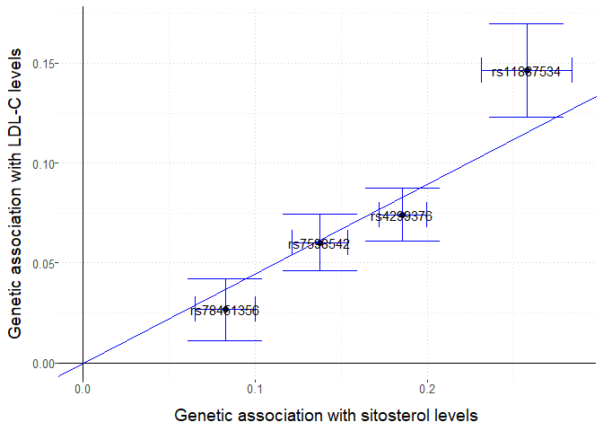
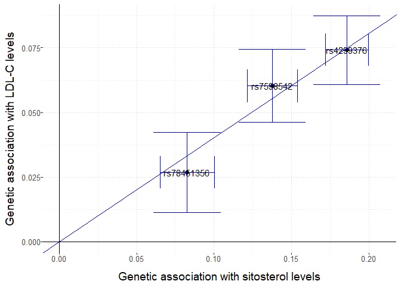
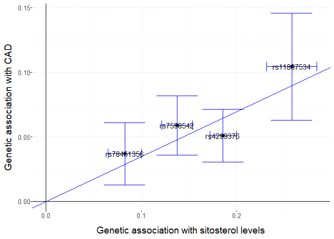
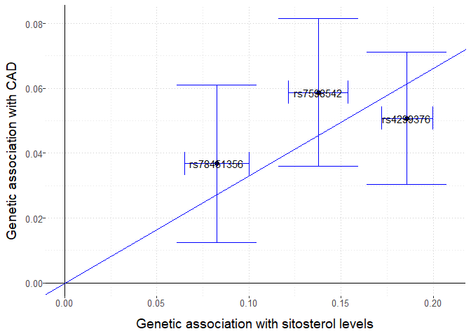

Funktionelle Genomanalysen 2023 (09-CRT-A006)
================
Dr. Janne Pott
09.-11. Juni 2023

- <a href="#allgemeine-informationen"
  id="toc-allgemeine-informationen">Allgemeine Informationen</a>
  - <a href="#initialisierung" id="toc-initialisierung">Initialisierung</a>
  - <a href="#daten-einlesen" id="toc-daten-einlesen">Daten einlesen</a>
- <a href="#mendelian-randomization"
  id="toc-mendelian-randomization">Mendelian Randomization</a>
  - <a href="#hintergrund" id="toc-hintergrund">Hintergrund</a>
  - <a href="#vorbereitung" id="toc-vorbereitung">Vorbereitung</a>
  - <a href="#sitosterol-auf-ldlc" id="toc-sitosterol-auf-ldlc">Sitosterol
    auf LDLC</a>
  - <a href="#sitosterol-auf-cad" id="toc-sitosterol-auf-cad">Sitosterol auf
    CAD</a>
- <a href="#sessioninfo" id="toc-sessioninfo">SessionInfo</a>

# Allgemeine Informationen

**Ziel**: Das Ziel dieses Tutoriums ist es, für drei Phänotypen eine
Mendelische Randomisierungsstudie durchzuführen, um die praktische
Anwendung und Interpretation der Ergebnisse dieser Methode aufzuzeigen.

**Daten**: Wir werden in diesem Beispiel Teilmengen von bereits
publizierten GWAS verwenden

- LDLC Summary Statistics von [Surakka, I. et al. Nat Genet
  (2015).](https://www.nature.com/articles/ng.3300), [Link to complete
  data](http://diagram-consortium.org/2015_ENGAGE_1KG/)
- CAD Summary Statistics von [Nikpay, M. et al. Nat Genet
  (2015).](https://www.nature.com/articles/ng.3396), [Link to complete
  data](http://www.cardiogramplusc4d.org/data-downloads/)
- Sitosterol Summary Statistics von [Scholz, M. et al. Nat Commun
  (2022).](https://www.nature.com/articles/s41467-021-27706-6), [Link to
  complete data](https://zenodo.org/record/5607613)

**Hinweis**: Das Sitosterol-Paper kennen Sie bereits aus der Vorlesung.
Wir werden hier ähnliche Analysen durchführen, aber nicht die exakt
gleichen, da wir *nur* die Summary Statistics und nicht die
konditionierten Statistiken verwenden werden. Zusätzlich wird nur der
Lokus auf Chromosom 2 betrachtet. Es handelt sich also nur um ein
Minimal-Beispiel, wir werden nicht die exakten Werte der Publikation
replizieren.

## Initialisierung

zuerst laden wir alle notwendigen Pakete. Es handelt sich hierbei um
**alle** Pakete für beide Tutorials!

``` r
# load required packages
library(coloc)
```

    ## This is coloc version 5.2.2

``` r
library(data.table)
setDTthreads(1)
library(ggplot2)
library(ggpubr)
library(hyprcoloc)
library(plyr)
```

    ## 
    ## Attaching package: 'plyr'

    ## The following object is masked from 'package:ggpubr':
    ## 
    ##     mutate

``` r
library(MendelianRandomization)
```

## Daten einlesen

Im Moodle-Kurs finden Sie eine .RData Datei, die bereits alle
notwendigen Tabellen enthält und einfach in R eingelesen werden kann.
Sie enthält die folgenden *data.tables*:

- tab_LDL
- tab_CAD
- tab_SIT

Das R-Paket *data.table* ist sehr performant für das handling von großen
Daten in R. Weitere Infos dazu finden Sie unter
<https://r-datatable.com>.

``` r
load("RPractical.RData")
ls()
```

    ## [1] "tab_CAD" "tab_LDL" "tab_SIT" "time0"

``` r
str(tab_LDL)
```

    ## Classes 'data.table' and 'data.frame':   7404 obs. of  8 variables:
    ##  $ chr     : chr  "chr2" "chr2" "chr2" "chr2" ...
    ##  $ pos     : int  43072828 43072997 43073247 43073548 43074225 43074392 43074468 43075563 43076226 43076271 ...
    ##  $ EA_LDL  : chr  "G" "G" "G" "G" ...
    ##  $ OA_LDL  : chr  "C" "T" "A" "T" ...
    ##  $ beta_LDL: num  -0.002394 0.000829 -0.00232 -0.002323 -0.004573 ...
    ##  $ SE_LDL  : num  0.00634 0.0071 0.00634 0.00633 0.00646 ...
    ##  $ pval_LDL: num  0.706 0.907 0.714 0.714 0.479 ...
    ##  $ N_LDL   : int  58309 58313 58314 58310 58322 58312 58312 58311 53241 58316 ...
    ##  - attr(*, ".internal.selfref")=<externalptr>

``` r
str(tab_CAD)
```

    ## Classes 'data.table' and 'data.frame':   7558 obs. of  10 variables:
    ##  $ rsID    : chr  "rs1123695" "rs78735937" "rs57242328" "rs4953671" ...
    ##  $ chr     : int  2 2 2 2 2 2 2 2 2 2 ...
    ##  $ pos     : int  43072828 43072997 43073247 43073548 43074225 43074392 43074468 43075563 43076226 43076271 ...
    ##  $ EA_CAD  : chr  "G" "G" "G" "G" ...
    ##  $ OA_CAD  : chr  "C" "T" "A" "T" ...
    ##  $ EAF_CAD : num  0.635 0.762 0.635 0.635 0.635 ...
    ##  $ beta_CAD: num  0.0192 -0.0191 0.019 0.0192 0.0187 ...
    ##  $ SE_CAD  : num  0.00957 0.01094 0.00956 0.00955 0.00953 ...
    ##  $ pval_CAD: num  0.0444 0.0808 0.0469 0.0444 0.0491 ...
    ##  $ N_CAD   : num  169427 169427 169427 169427 169427 ...
    ##  - attr(*, ".internal.selfref")=<externalptr>

``` r
str(tab_SIT)
```

    ## Classes 'data.table' and 'data.frame':   6176 obs. of  10 variables:
    ##  $ rsID    : chr  "rs1123695" "rs78735937" "rs57242328" "rs4953671" ...
    ##  $ chr     : int  2 2 2 2 2 2 2 2 2 2 ...
    ##  $ pos     : num  43072828 43072997 43073247 43073548 43074225 ...
    ##  $ EA_SIT  : chr  "C" "T" "A" "T" ...
    ##  $ OA_SIT  : chr  "G" "G" "G" "G" ...
    ##  $ EAF_SIT : num  0.334 0.234 0.334 0.334 0.334 ...
    ##  $ beta_SIT: num  -0.000746 0.008861 -0.000669 -0.000584 -0.000699 ...
    ##  $ SE_SIT  : num  0.00718 0.00799 0.00718 0.00717 0.00717 ...
    ##  $ pval_SIT: num  0.908 0.264 0.917 0.926 0.913 ...
    ##  $ N_SIT   : int  9755 9755 9755 9755 9755 9755 9755 9755 9755 9755 ...
    ##  - attr(*, ".internal.selfref")=<externalptr>

``` r
tab_SIT[pval_SIT == min(pval_SIT),]
```

    ##         rsID chr      pos EA_SIT OA_SIT   EAF_SIT  beta_SIT     SE_SIT
    ## 1: rs4299376   2 44072576      T      G 0.6822883 -0.185747 0.00708307
    ##        pval_SIT N_SIT
    ## 1: 1.48146e-151  9755

Die Datensätze sind jeweils schon eingeschränkt auf Chromosom 2 und die
Region um best-assoziierten SNP von SIT herum (Basenposition 44072576
+/- 1 Mio. Basen).

# Mendelian Randomization

## Hintergrund

<figure>

<figcaption aria-hidden="true">Vergleich RCT vs. MR</figcaption>
</figure>

Das Ziel einer MR ist die Beschreibung von einem kausalen Effekt von
einem Risikofaktor *X* auf ein Outcome bzw. Krankheit *Y*.

Bei einer klassischen randomisierten Studie werden die Probanden in zwei
Gruppen geteilt, wobei die eine Gruppe die Intervention/das Medikament
bekommt, während die andere nur ein Placebo erhält.

Bei einer MR Studie werden die Probanden stattdessen aufgrund ihres
Genotyps in Gruppen geteilt, die mit Risiko-Allel gegen diejenigen ohne
das Risiko-Allel. Man kann von einer Randomisierung während Meiose
ausgehen, und berücksichtigt nur noch die genetisch vorhergesagten Werte
von $X$ und $Y$ bzw. die genetischen Effekt auf $X$ und $Y$. Um valide
kausale Schätzer zu erhalten müssen drei Bedingungen gelten:

1)  Die Assoziation der genetischen Variante *G* auf *X* ist **stark**,
    z.B. genomweit signifikant.
2)  Der SNP *G* ist unabhängig von **allen** Confoundern *U*, d.h. *G*
    ist nicht auch mit diesen assoziiert.
3)  Der SNP *G* ist unabhängig von *Y*, bis auf den Effekt der durch *X*
    vermittelt wird, d.h. es gibt keinen direkten Effekt von *G* auf
    *Y*.

Während man die erste Bedingung gut nachweisen kann, kann man die
anderen beiden nur plausibilisieren (man kennt nicht alle Confounder;
man kann nur für die testen, zu denen man Daten hat). Wenn die
Bedingungen (plausibel) erfüllt sind, kann man mittels folgenden Model
einen Ratio-Schätzer ableiten ($\beta_{IV}$, durch die Genetik erklärte
Effekt von *X* auf *Y*, *IV*= instrumenal variable):

$$ Y \sim \beta_{IV} \cdot X = \beta_{IV} \cdot (\beta_X \cdot G) = \beta_Y \cdot G$$

$$ \Longrightarrow \hat{\beta}_{IV} = \frac{\hat{\beta}_Y}{\hat{\beta}_X}$$

Den Standardfehler kann mittels der Delta-Methode bestimmen.
Üblicherweise schneidet man nach dem ersten oder zweiten Term ($SE_1$
bzw. $SE_2$) ab:

$$SE_1(\hat{\beta}_{IV}) = \sqrt{se(\hat{\beta}_Y^2) / \hat{\beta}_X^2}$$

$$SE_2(\hat{\beta}_{IV}) = \sqrt{\frac{se(\hat{\beta}_Y)^2}{\hat{\beta}_X^2} + \frac{\hat{\beta}_Y^2se(\hat{\beta}_X)^2}{\hat{\beta}_X^4}}$$

Mit der oben gezeigten Ratio-Methode kann man einzelne SNPs verwenden.
Allerdings hat man meistens mehrere genetische Assoziationen, die man
auch in einer Meta-Analyse kombinieren kann, um robustere Ergebnisse zu
erhalten. Dies funktioniert auch, wenn die Statistiken von
unterschiedlichen GWASs stammen und entspricht einem fixed Effekt
Modell. Man sollte vorher sicherstellen, dass die SNPs nicht korreliert
sind. Falls doch kann man die Korrelationsmatrix verwenden um darauf zu
korrigieren.

$$\hat\beta_{IV,IVW} = \frac{\sum{\hat{\beta}_Y}\hat{\beta}_Xse(\hat{\beta}_Y)^{-2}}{\sum{\hat{\beta}_X^2se(\hat{\beta}_Y)^{-2}}}$$

$$SE(\hat\beta_{IV,IVW}) = \sqrt{\frac{1}{\sum{\hat{\beta}_X^2se(\hat{\beta}_Y)^{-2}}}}$$

In dem Paket **MendelianRandomization** sind inzwischen viele Varianten
der MR mittels Summary Statistics implementiert. Die IVW-Methode ist nur
eine davon. Andere berücksichtigen etwaige Pleiotropie (z.B.
*MR_egger*).

## Vorbereitung

Zunächst reduzieren wir unsere Tabelle auf die vier unabhängigen SNPs:

``` r
# same steps as in coloc tutorial!
tab_LDL[,chr := 2]
tab_dummy = data.frame(pos = unique(c(tab_CAD$pos, tab_LDL$pos, tab_SIT$pos)))
tab = Reduce(function(x, y) plyr::join(x, y), list(tab_dummy, tab_CAD, tab_LDL, tab_SIT))
```

    ## Joining by: pos

    ## Joining by: pos, chr

    ## Joining by: pos, rsID, chr

``` r
tab = tab[complete.cases(tab),]
setDT(tab)

tab_MR = copy(tab)
tab_MR = tab_MR[rsID %in% c("rs4299376","rs11887534","rs7598542","rs78451356")]
tab_MR
```

    ##         pos       rsID chr EA_CAD OA_CAD  EAF_CAD  beta_CAD    SE_CAD
    ## 1: 44033754 rs78451356   2      T      G 0.834412 -0.036754 0.0123792
    ## 2: 44066247 rs11887534   2      G      C 0.943046  0.104331 0.0211813
    ## 3: 44072576  rs4299376   2      T      G 0.681600 -0.050772 0.0104609
    ## 4: 44093276  rs7598542   2      G      C 0.789130  0.058747 0.0116623
    ##      pval_CAD  N_CAD EA_LDL OA_LDL  beta_LDL   SE_LDL pval_LDL N_LDL EA_SIT
    ## 1: 2.9876e-03 169427      T      G -0.026716 0.007922 7.49e-04 58307      G
    ## 2: 8.4100e-07 169427      G      C  0.146315 0.012007 4.05e-34 58305      C
    ## 3: 1.2100e-06 169427      G      T  0.074148 0.006780 8.34e-28 58308      T
    ## 4: 4.7200e-07 169427      G      C  0.060197 0.007196 6.32e-17 58288      C
    ##    OA_SIT    EAF_SIT   beta_SIT     SE_SIT     pval_SIT N_SIT
    ## 1:      T 0.16763822  0.0826786 0.00895504  2.61288e-20  9755
    ## 2:      G 0.06461227 -0.2579130 0.01338180  9.76198e-83  9755
    ## 3:      G 0.68228833 -0.1857470 0.00708307 1.48146e-151  9755
    ## 4:      G 0.21491200 -0.1376980 0.00823069  8.10361e-63  9755

Diese vier SNPs sind unabhängig bzw haben unabhängige Effekte gemäß der
konditionierten Analyse, die Sie in der Phytosterol-Publikation
nachlesen können. Nur rs11887534 ist korreliert mit den beiden SNPs, die
in der Coloc-Analyse als kausales geteiltes Signal erkannt wurden:

- rs11887534 und rs76866386: $r^2 = 0.933$
- rs11887534 und rs75331444: $r^2 = 0.946$
- rs76866386 und rs75331444: $r^2 = 0.986$

Nun müssen wir noch die Effekte anpassen: zum einen muss immer das
gleiche Effekt-Allel verwendet werden (zwingend notwendig), zum anderen
wollen wir immer einen positiven Effekt auf Sitosterol (optional, ändert
nicht den Schätzer, nur den Plot).

``` r
tab_MR[,EA := c("G","G","G","G")]
tab_MR[,OA := c("T","C","T","C")]

tab_MR[,table(EA == EA_LDL, OA == EA_LDL)]
```

    ##        
    ##         FALSE TRUE
    ##   FALSE     0    1
    ##   TRUE      3    0

``` r
tab_MR[OA == EA_LDL, beta_LDL := beta_LDL * (-1)]

tab_MR[,table(EA == EA_CAD, OA == EA_CAD)]
```

    ##        
    ##         FALSE TRUE
    ##   FALSE     0    2
    ##   TRUE      2    0

``` r
tab_MR[OA == EA_CAD, beta_CAD := beta_CAD * (-1)]
tab_MR[OA == EA_CAD, EAF_CAD := 1- EAF_CAD]

tab_MR[,table(EA == EA_SIT, OA == EA_SIT)]
```

    ##        
    ##         FALSE TRUE
    ##   FALSE     0    3
    ##   TRUE      1    0

``` r
tab_MR[OA == EA_SIT, beta_SIT := beta_SIT * (-1)]
tab_MR[OA == EA_SIT, EAF_SIT := 1- EAF_SIT]
```

## Sitosterol auf LDLC

zuerst testen wir den kausalen Effekt von Sitosterol auf LDLC. Dabei
erstellen wir die Ratio-Schätzer (nur zum Vergleich) und die Kombination
aller vier Schätzer (alle Methoden des R-Pakets
*MendelianRandomization*). Da es sich hierbei auch um eine Meta-Analyse
handelt, werden auch hier Heterogenitätsschätzer mit-ausgegeben. Dazu
muss man jedoch spezifisch eine Methode auswählen (hier im Beispiel
nehmen wir IVW).

``` r
tab_MR[,beta_LDL/beta_SIT]
```

    ## [1] 0.3231308 0.5673037 0.3991881 0.4371668

``` r
tab_MR[,sqrt(SE_LDL^2/beta_SIT^2)]
```

    ## [1] 0.09581681 0.04655446 0.03650126 0.05225929

``` r
MR_object1 = mr_input(bx = tab_MR$beta_SIT, 
                      bxse = tab_MR$SE_SIT,
                      by = tab_MR$beta_LDL,
                      byse = tab_MR$SE_LDL,
                      snps = tab_MR$rsID,
                      exposure = "sitosterol levels", 
                      outcome = "LDL-C levels")

res1 = mr_allmethods(MR_object1)
mr_plot(object = MR_object1, interactive = F,labels = T,line = "ivw")
```

<!-- -->

``` r
res1
```

    ##                     Method Estimate Std Error 95% CI         P-value
    ##              Simple median    0.418     0.037   0.346  0.491   0.000
    ##            Weighted median    0.424     0.036   0.352  0.495   0.000
    ##  Penalized weighted median    0.409     0.034   0.342  0.475   0.000
    ##                                                                     
    ##                        IVW    0.448     0.045   0.361  0.536   0.000
    ##              Penalized IVW    0.412     0.028   0.357  0.466   0.000
    ##                 Robust IVW    0.441     0.057   0.330  0.553   0.000
    ##       Penalized robust IVW    0.411     0.015   0.382  0.441   0.000
    ##                                                                     
    ##                   MR-Egger    0.601     0.121   0.365  0.837   0.000
    ##                (intercept)   -0.026     0.020  -0.065  0.012   0.180
    ##         Penalized MR-Egger    0.601     0.121   0.365  0.837   0.000
    ##                (intercept)   -0.026     0.020  -0.065  0.012   0.180
    ##            Robust MR-Egger    0.601     0.090   0.424  0.778   0.000
    ##                (intercept)   -0.026     0.011  -0.047 -0.005   0.014
    ##  Penalized robust MR-Egger    0.601     0.090   0.424  0.778   0.000
    ##                (intercept)   -0.026     0.011  -0.047 -0.005   0.014

``` r
res1_ivw = mr_ivw(MR_object1)
res1_ivw@Heter.Stat
```

    ## [1] 10.09645520  0.01776378

Wir sehen also einen kausale Beziehung von SIT auf LDLC über alle
Methoden hinweg, und in der Egger-Methode ist der Intercept nicht
signifikant von 0 unterschiedlich, was auf keine Pleiotropie hindeutet.

Es ist eine gewisse Effekt-Heterogenität vorhanden (Cochrans Q = 10.1,
p=0.02). Im Plot kann man erkennen, dass rs11887534, das mit LDL und CAD
in Coloc als geteilt gefunden wurde, den stärksten Effekt hat. Man
könnte hier mittels “leave one out” diese Variante entfernen und prüfen,
ob immer noch ein Effekt übrig bleibt und ob die Heterogenität durch
diesen SNP verursacht wurde:

``` r
tab_MR$rsID
```

    ## [1] "rs78451356" "rs11887534" "rs4299376"  "rs7598542"

``` r
MR_object2 = mr_input(bx = tab_MR$beta_SIT[-2], 
                      bxse = tab_MR$SE_SIT[-2],
                      by = tab_MR$beta_LDL[-2],
                      byse = tab_MR$SE_LDL[-2],
                      snps = tab_MR$rsID[-2],
                      exposure = "sitosterol levels", 
                      outcome = "LDL-C levels")

res2 = mr_allmethods(MR_object2)
mr_plot(object = MR_object2, interactive = F,labels = T,line = "ivw")
```

<!-- -->

``` r
res1@Values[4,]
```

    ##   Method  Estimate  Std Error   95% CI                 P-value
    ## 4    IVW 0.4484996 0.04466434 0.3609591 0.5360401 1.000796e-23

``` r
res2@Values[4,]
```

    ##   Method  Estimate  Std Error   95% CI                 P-value
    ## 4    IVW 0.4037751 0.02856395 0.3477908 0.4597594 2.284186e-45

``` r
res2_ivw = mr_ivw(MR_object2)
res2_ivw@Heter.Stat
```

    ## [1] 1.1324419 0.5676666

Wenn nur noch diese drei Varianten verwendet werden, gibt es immer noch
ein signifikantes Ergebnis, und die Konfidenzintervalle der zwei Sets
überlappen. AUch die Heterogenität nimmt ab und ist nicht mehr
signifikant.

## Sitosterol auf CAD

``` r
MR_object3 = mr_input(bx = tab_MR$beta_SIT, 
                      bxse = tab_MR$SE_SIT,
                      by = tab_MR$beta_CAD,
                      byse = tab_MR$SE_CAD,
                      snps = tab_MR$rsID,
                      exposure = "sitosterol levels", 
                      outcome = "CAD")

MR_object4 = mr_input(bx = tab_MR$beta_SIT[-2], 
                      bxse = tab_MR$SE_SIT[-2],
                      by = tab_MR$beta_CAD[-2],
                      byse = tab_MR$SE_CAD[-2],
                      snps = tab_MR$rsID[-2],
                      exposure = "sitosterol levels", 
                      outcome = "CAD")

mr_plot(object = MR_object3, interactive = F,labels = T,line = "ivw")
```

<!-- -->

``` r
mr_plot(object = MR_object4, interactive = F,labels = T,line = "ivw")
```

<!-- -->

``` r
res3 = mr_allmethods(MR_object3)
```

    ## Warning in lmrob.S(x, y, control = control): find_scale() did not converge in
    ## 'maxit.scale' (= 500) iterations with tol=1e-10, last rel.diff=0

    ## Warning in lmrob.S(x, y, control = control): find_scale() did not converge in
    ## 'maxit.scale' (= 500) iterations with tol=1e-10, last rel.diff=0

    ## Warning in lf.cov(init, x = x): .vcov.avar1: negative diag(<vcov>) fixed up;
    ## consider 'cov=".vcov.w."' instead

    ## Warning in lmrob.S(x, y, control = control): find_scale() did not converge in
    ## 'maxit.scale' (= 500) iterations with tol=1e-10, last rel.diff=0

    ## Warning in lmrob.S(x, y, control = control): find_scale() did not converge in
    ## 'maxit.scale' (= 500) iterations with tol=1e-10, last rel.diff=0

    ## Warning in lf.cov(init, x = x): .vcov.avar1: negative diag(<vcov>) fixed up;
    ## consider 'cov=".vcov.w."' instead

``` r
res4 = mr_allmethods(MR_object4)
```

    ## Warning in lmrob.S(x, y, control = control): find_scale() did not converge in
    ## 'maxit.scale' (= 500) iterations with tol=1e-10, last rel.diff=0

    ## Warning in lmrob.S(x, y, control = control): find_scale() did not converge in
    ## 'maxit.scale' (= 500) iterations with tol=1e-10, last rel.diff=0

``` r
res3@Values[4,]
```

    ##   Method  Estimate  Std Error  95% CI                 P-value
    ## 4    IVW 0.3481691 0.04249927 0.264872 0.4314661 2.561643e-16

``` r
res4@Values[4,]
```

    ##   Method  Estimate  Std Error   95% CI                 P-value
    ## 4    IVW 0.3314358 0.04475265 0.2437222 0.4191494 1.302165e-13

``` r
res3_ivw = mr_ivw(MR_object3)
res4_ivw = mr_ivw(MR_object4)
res3_ivw@Heter.Stat
```

    ## [1] 3.5088825 0.3196119

``` r
res4_ivw@Heter.Stat
```

    ## [1] 2.8982672 0.2347736

Wir finden ebenfalls einen kausalen Zusammenhang zu Koronarer
Herzkrankheit. Wenn wir nun zunsatzlich wissen, wie der MR-Schätzer für
LDLC auf CAD ist, können wir abschätzen, wie viel vom Sitosterol-Effekt
über LDLC mediiert wird.

**Hinweis**: Mit diesen zur Verfügung gestellten Daten lässt sich der
LDLC Effekt nicht bestimmen, da hier nur ein Lipid-Lokus enthalten ist,
aber LDLC sehr polygenetisch ist (über 200 Risiko-Loki bekannt).
Zusätzlich müssen die verwendeten SNPs für unterschiedliche
Risikofaktoren ebenfalls unterschiedlich bzw. nicht in LD sein. Diese
Annahme ist in unserem kleinen Beispieldatensatz verletzt.

# SessionInfo

``` r
sessionInfo()
```

    ## R version 4.2.2 (2022-10-31 ucrt)
    ## Platform: x86_64-w64-mingw32/x64 (64-bit)
    ## Running under: Windows 10 x64 (build 19045)
    ## 
    ## Matrix products: default
    ## 
    ## locale:
    ## [1] LC_COLLATE=English_United Kingdom.utf8 
    ## [2] LC_CTYPE=English_United Kingdom.utf8   
    ## [3] LC_MONETARY=English_United Kingdom.utf8
    ## [4] LC_NUMERIC=C                           
    ## [5] LC_TIME=English_United Kingdom.utf8    
    ## 
    ## attached base packages:
    ## [1] stats     graphics  grDevices utils     datasets  methods   base     
    ## 
    ## other attached packages:
    ## [1] MendelianRandomization_0.7.0 plyr_1.8.8                  
    ## [3] hyprcoloc_1.0                ggpubr_0.6.0                
    ## [5] ggplot2_3.4.1                data.table_1.14.8           
    ## [7] coloc_5.2.2                 
    ## 
    ## loaded via a namespace (and not attached):
    ##  [1] viridis_0.6.3      httr_1.4.5         tidyr_1.3.0        jsonlite_1.8.4    
    ##  [5] viridisLite_0.4.1  splines_4.2.2      foreach_1.5.2      carData_3.0-5     
    ##  [9] highr_0.10         mixsqp_0.3-48      arrangements_1.1.9 yaml_2.3.7        
    ## [13] robustbase_0.95-0  pillar_1.9.0       backports_1.4.1    lattice_0.20-45   
    ## [17] quantreg_5.94      glue_1.6.2         digest_0.6.31      RColorBrewer_1.1-3
    ## [21] ggsignif_0.6.4     iterpc_0.4.2       colorspace_2.1-0   susieR_0.12.35    
    ## [25] htmltools_0.5.4    Matrix_1.5-1       pkgconfig_2.0.3    pheatmap_1.0.12   
    ## [29] broom_1.0.4        SparseM_1.81       purrr_1.0.1        scales_1.2.1      
    ## [33] MatrixModels_0.5-1 tibble_3.2.0       gmp_0.7-1          farver_2.1.1      
    ## [37] generics_0.1.3     car_3.1-2          withr_2.5.0        lazyeval_0.2.2    
    ## [41] Rmpfr_0.9-2        cli_3.6.0          survival_3.4-0     magrittr_2.0.3    
    ## [45] crayon_1.5.2       evaluate_0.20      fansi_1.0.4        MASS_7.3-58.1     
    ## [49] rstatix_0.7.2      tools_4.2.2        lifecycle_1.0.3    matrixStats_1.0.0 
    ## [53] plotly_4.10.1      munsell_0.5.0      glmnet_4.1-6       irlba_2.3.5.1     
    ## [57] compiler_4.2.2     rlang_1.1.0        grid_4.2.2         iterators_1.0.14  
    ## [61] rstudioapi_0.14    rjson_0.2.21       htmlwidgets_1.6.2  labeling_0.4.2    
    ## [65] rmarkdown_2.20     gtable_0.3.3       codetools_0.2-18   abind_1.4-5       
    ## [69] reshape_0.8.9      R6_2.5.1           gridExtra_2.3      knitr_1.42        
    ## [73] dplyr_1.1.0        fastmap_1.1.1      utf8_1.2.3         shape_1.4.6       
    ## [77] Rcpp_1.0.10        vctrs_0.5.2        DEoptimR_1.0-11    tidyselect_1.2.0  
    ## [81] xfun_0.37

``` r
message("\nTOTAL TIME : " ,round(difftime(Sys.time(),time0,units = "mins"),3)," minutes")
```

    ## 
    ## TOTAL TIME : 0.093 minutes
